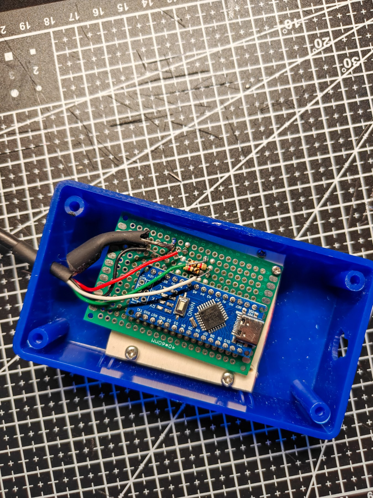
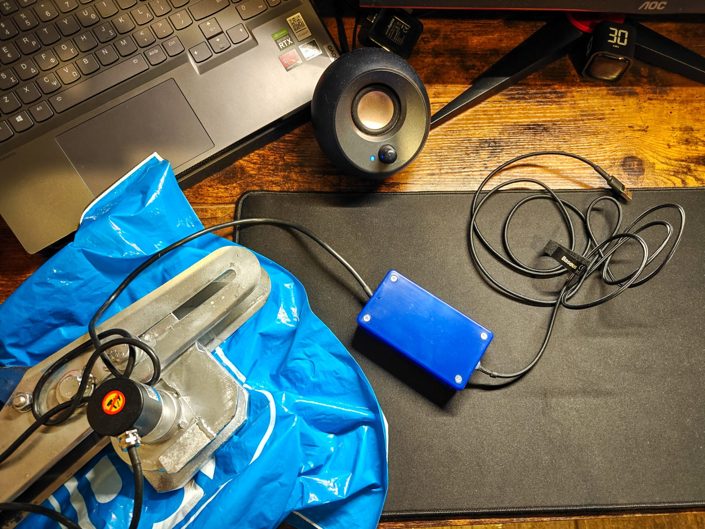

# well-camera-depth-counter
A real-time depth tracking system built for borehole inspection 
cameras, developed under tight time constraints as a complete 
hardware + software solution.

## The Problem

Borehole inspection cameras typically display live video but 
provide no way to record or overlay the current cable depth 
on the footage.usually This makes it hard to log findings accurately 
during geological surveys.

The PASI Well-Camera.1N borehole inspection system had no built-in way to record cable depth during surveys. Rather than purchasing the manufacturer's official encoder accessory (€400-800+), my custom solution had a total cost of under €20.

## The Solution

A custom depth counter system that:
- Tracks cable depth in real time using a rotary encoder
- Overlays the depth reading live onto OBS Studio recordings
- Packages everything into a simple standalone Windows app

## System Overview





## Hardware

- Arduino Nano (CH340 clone)
- Incremental Rotary Encoder 400P/R
- Custom prototype PCB (40×60mm)
- 1kΩ pull-up resistors on signal pins A4/A5
- Hot glue mechanical reinforcement for field conditions

## Software Stack

- **Arduino (C++)** - reads encoder via Pin Change Interrupts,
  streams depth over Serial at 200ms intervals
- **Python + Tkinter** - reads Serial, writes to depth.txt,
  provides simple GUI with COM port selection and depth reset
- **OBS Studio** - reads depth.txt via Text GDI+ source,
  overlays depth on video in real time
- **PyInstaller** - packages Python app into standalone .exe

## Features

- Real-time depth display accurate to 0.01m
- Zero-depth reset button
- Standalone .exe no Python installation needed on target machine
- Persistent OBS integration  set up once, works every time
- Mechanically reinforced for rough field environments

## Build Notes

All components were soldered onto a prototype PCB. Connections 
were mechanically secured with hot glue to ensure reliability 
in field conditions where rough conditions is a factor.The encoder 
was mounted directly on the cable reel mechanism by a mechanic.

The entire system was designed, assembled, and deployed within 
a short timeframe due to urgent operational deadline.

## Configuration

To adjust for a different cable reel, change one line in the 
Arduino sketch:

```cpp
const float WHEEL_CIRCUMFERENCE_MM = 222.0; // the reels circumference
```

Then re-upload to the Arduino. No changes needed to the Python 
app or OBS.

## Development Notes

Arduino firmware and Python application were developed with 
the assistance of Claude. Hardware assembly, 
soldering, mechanical mounting inside the project box, and system integration were 
done manually.

## Requirements

- Windows 10/11
- OBS Studio
- CH340 USB driver (for Arduino Nano clone)
- Arduino IDE (for firmware modifications only)

